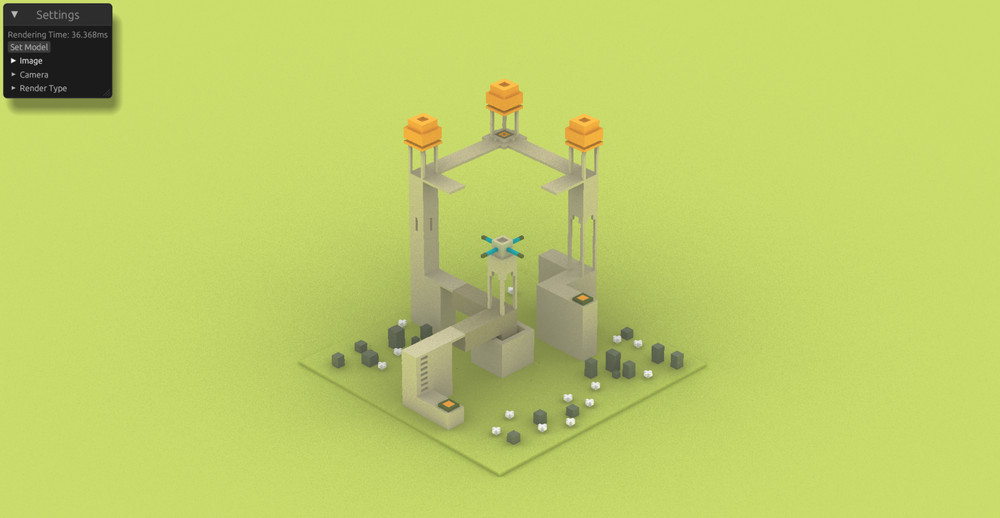
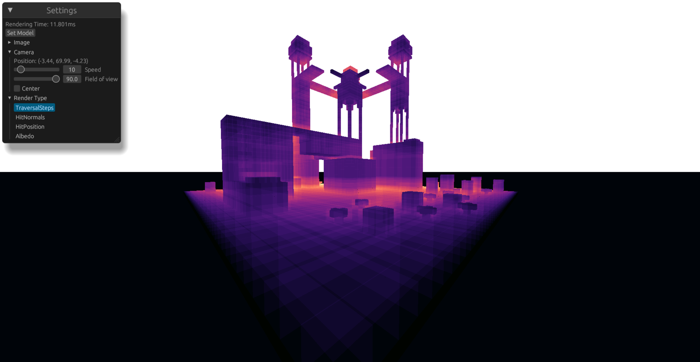

# voxel-engine

A path tracer for .vox file types.

A gradient view of the traversal steps.

# Inspirations

- [Xima](https://www.youtube.com/@xima1)
- [A guide to fast voxel ray tracing using sparse 64-trees](https://dubiousconst282.github.io/2024/10/03/voxel-ray-tracing/)

# Build requirements on windows

- [Vulkan SDK](https://vulkan.lunarg.com/sdk/home): With the shader toolchain debug symbols

OR

- [CMake](https://cmake.org/download/)
- [Ninja](https://github.com/ninja-build/ninja/releases)
- [Python](https://www.python.org/downloads/)

Then run with `CMAKE_POLICY_VERSION_MINIMUM=3.5 cargo run` since shaderc has a minimum version incompatilibiliy with CMake if you're running an up to date version of CMake.

We need all of these because `vulkan_shaders` uses shaderc wich is a C++ lib. You can either download the exe (which they don't provide supported binaries for, like the link doesn't event work anymore) or build it from source. Building from source requires CMake, Ninja & Python. Or.... you could download the Vulkan SDK (3.09GB) which is quite a lot.

I could use naga to compile the shaders manually and try to setup all the code to create the right spirv options. But this would mean to also not use the `egui_winit_vulkano` crate (because they use vulkano_shaders too). Which would also mean that I would need to recreate the egui integration. This is a lot of code that isn't the focus of this application.

# References

- [Vox models and file format](https://github.com/ephtracy/voxel-model/tree/master)
- [More vox models](https://paulbourke.net/dataformats/vox/models/)
- [Vox file structure](https://astrorenales.github.io/vox-viewer/)
- [Voxel viewer](https://florianfe.github.io/vox-viewer/demo/)
- [Vulkan spec for push constants and uniforms "Offset and Stride Assignment"](https://registry.khronos.org/vulkan/specs/latest/html/vkspec.html#interfaces-resources-layout)
- [Cool visualizer of unfiform blocks in hlsl that doesn't fit what I need since I use glsl](https://maraneshi.github.io/HLSL-ConstantBufferLayoutVisualizer/)
- [Great video explaining push constant alignment](https://www.youtube.com/watch?v=wlLGLWI9Fdc)
- [Voxel Cone tracing but better](https://jose-villegas.github.io/post/deferred_voxel_shading/)
- [Better than cone tracing?](https://onlinelibrary.wiley.com/doi/10.1111/cgf.15262)
- [Creating 64 trees for traversal](https://dubiousconst282.github.io/2024/10/03/voxel-ray-tracing/)
- [Vulkan GPU Info](https://vulkan.gpuinfo.org/)
- [Explanation of 3d dda algorithm](https://www.youtube.com/watch?v=ztkh1r1ioZo)
- [GLSL functions](https://docs.gl/)
- [Slab intersection visualizer](https://www.mathematik.uni-marburg.de/~thormae/lectures/graphics2/graphics_2_2_eng_web.html#20)
- [Unitiy builds for shader includes](https://austinmorlan.com/posts/unity_jumbo_build/): I'm not sure if it would benefit for compiling performance. But it really reduces the headache to import and see what is defined. + I don't need #ifndef and more macros.
- [Downloadable voxel models](https://github.com/enkisoftware/voxel-models#other-voxel-resources)
