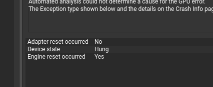

# TODO

###

### Add multiple bounces and diffuse materials

### Add focal blur setting

## Benchark log

#### Creating an actual benchmarker

Starting the window, the engine and then looking at frame time is not a great idea for benchmarking. This is because to test different angles, setups would mean the steps of running the app, wait for the window to appear, move to a specific position in the world would take a long time between retries. But also, the setups could be incosistent and tedious. However, benchmarking this game engine is not a simple task.

There are two options that present ourselves that have various pros and cons:

1. Create my own benchmarker
   - Pros:
     - Don't have to rewrite code
     - Can view the tests while they are running!
     - Creating a benchmarking app would be kinda cool
   - Cons:
     - Would have to transform the Application part of the code into having a whole benchmarking suite
2. Use an external library
   - Pros:
     - Don't have to write an entire library to benchmark
     - Could use cirterion that can use statistics, plots and "more rigorous" benchmarking
     - Would decouple the code into making the entire engine run as a headless application rendering to an image
     - The benchmarking part of the engine would be decoupled from the application
     - Running benchmarks would be less tedious
   - Cons:
     - Rewriting a lot of code

#### Precomputing camera viewport

- Compute shader time: 0.74ms (20% improvement!)
- Copy to present image time: 0.26ms

This is the thing that I (and chat gpt but I thought of it first) would make the biggest difference. Its the same computation over and over again for each pixel that we cut out the viewport calculation into the cpu once and reuse them each time. We only recalculate on the resizing of the image and when we move the camera.

#### branchless checking for delta t

- from 0.94ms to 0.93ms

#### Expanding casts between ve4 and vec3

- no difference.

#### Installing nvidia drivers

- Compute shader time: 0.92ms
- Copy to present image time: 0.26ms

Debian uses `nouveau` which are open source nvidia drivers. After installing the nvidia drivers the times just decresed and are more consistant. They did say that the nouveau drivers are slower but gdaaam these are fast. I didn't event need to optimize that much. I do wonder if I could optimize some more by changing the shader code. But this seems like overkill.

After writing out just a white image. It seems like the minimum time for rendering a compute shader is ~0.3ms. This means that I can definitely optimize the shader code a lot. This is great! This means that I have so much more room to code an actually ray tracer on voxels!

#### Adding the UI

- Compute shader time: ~5ms
- Copy to present image time: ~1.6ms

This is surprising since I haven't changed anyting besides adding a GUI. The timings are calculatd per swapchain image for the compute and copy operations and do not include the GUI which is why I am surprised.

The only thing that can make a difference is that the swapchain images now use R16B16G16A16_SFLOAT by default (the first format that appears on the surface capabilities) and it takes 0.6 ms more to copy the image. This would make sense but even without, the copy operation take ~1ms and not 0.96ms. Why is is it slower?

Cool thing though, changing the shader does have a real effect on performance. One division and multiplication less had 0.4 ms less on average!

#### Rendering a 10x10 cube in the middle of the screen

- Compute shader time: 2.88009925456032 ms
- Copy to present image time: 0.96153502934372 ms

This is very surprising. Since this is the base case and I haven't done any cool traversal yet, I would imagine that this would take less than 1 ms. However, even rendering a simple color image to the screen takes ~1 ms.

## Questions and answers.

#### Why do we have to align and pad the layout for the push constants?

The way that rust represents a struct is packed as closely as possible, eg: `struct A { a: Vec3, b: Vec3 }` will take `(32/8) * 3 * 2 = 24 bytes` since all the 6 floats are next to each other. However, the data representation of the std140 layout will padd according to [some rules](https://learnopengl.com/Advanced-OpenGL/Advanced-GLSL). These rules are that the starting offset for an element must be a multiple of its padded size. For example, a vec3's padded size is the size of a vec4, so the offset of the second vec3 will be 16 bytes. However, they will **NOT** pad at the end. So a struct of 2 vec3's will have a total size of 16 + 12 = 28 bytes.

#### What is a stencil image?

When you are making a grafiti, you use a stencil to "mask" the shape that you want to draw on. Imagine it like letters that are being painted on a cargo container.
A stencil image in vulkan is an image that is used like a mask to draw other images. Like a stencil in real life.

#### What are descriptor sets?

A descriptor is an object that "describes" some resource used by a shader pipeline. For example, a descriptor for an image could describe the color type, the size and other factors.
When you pass those resources to the pipeline they aren't passed 1 by 1, they are grouped into descriptor sets and then the whole set is passed to the pipeline to be used. Then each element of that set has a "binding" that can be bound to a variable in the shader.

###### What are descriptor sets layouts?

Read up on previous question. The layout of a descriptor set is an array of all the bindings of the descriptor sets and they type.

# DONE

- [x] Have only 1 output image instead of many
- [x] Debug 64 tree traversal
- [x] Implement 64 tree traveral: Sweet sweet 66% frame improvement from this. Frame from 90ms to 30ms babyyy
- [x] Add output image resolution change
- [x] Fix camera in spherical coordinates
- [x] Add free camera checkbox
- [x] Fix bug when looking away from the origin from inside the cube
- [x] Fix infinite loop in shader: Nvidia nsight graphics says that the device _hung_ while executing which I think its an infinite loop. 
- [x] Make the camera movement smooth with fixed FOV
- [x] Load magica voxel files 
- [x] Mandelbulb model for having different benchmarks later.
- [x] Headless rendering that allows benchmarking.
- [x] Reduce as much as possible the time it takes to render the simple example
- [x] Add a GUI to have real time performance on the screen
- [x] Make a moving camera
      
- [x] Create a 3D texture for tracing voxels

# Inspirations

- [Xima](https://www.youtube.com/@xima1)

# Build requirements on windows

- [Vulkan SDK](https://vulkan.lunarg.com/sdk/home): With the shader toolchain debug symbols

OR

- [CMake](https://cmake.org/download/)
- [Ninja](https://github.com/ninja-build/ninja/releases)
- [Python](https://www.python.org/downloads/)

Then run with `CMAKE_POLICY_VERSION_MINIMUM=3.5 cargo run` since shaderc has a minimum version incompatilibiliy with CMake if you're running an up to date version of CMake.

We need all of these because `vulkan_shaders` uses shaderc wich is a C++ lib. You can either download the exe (which they don't provide supported binaries for, like the link doesn't event work anymore) or build it from source. Building from source requires CMake, Ninja & Python. Or.... you could download the Vulkan SDK (3.09GB) which is quite a lot.

I could use naga to compile the shaders manually and try to setup all the code to create the right spirv options. But this would mean to also not use the `egui_winit_vulkano` crate (because they use vulkano_shaders too). Which would also mean that I would need to recreate the egui integration. This is a lot of code that isn't the focus of this application.

# References

- [Vox models and file format](https://github.com/ephtracy/voxel-model/tree/master)
- [More vox models](https://paulbourke.net/dataformats/vox/models/)
- [Vox file structure](https://astrorenales.github.io/vox-viewer/)
- [Voxel viewer](https://florianfe.github.io/vox-viewer/demo/)
- [Vulkan spec for push constants and uniforms "Offset and Stride Assignment"](https://registry.khronos.org/vulkan/specs/latest/html/vkspec.html#interfaces-resources-layout)
- [Cool visualizer of unfiform blocks in hlsl that doesn't fit what I need since I use glsl](https://maraneshi.github.io/HLSL-ConstantBufferLayoutVisualizer/)
- [Great video explaining push constant alignment](https://www.youtube.com/watch?v=wlLGLWI9Fdc)
- [Voxel Cone tracing but better](https://jose-villegas.github.io/post/deferred_voxel_shading/)
- [Better than cone tracing?](https://onlinelibrary.wiley.com/doi/10.1111/cgf.15262)
- [Creating 64 trees for traversal](https://dubiousconst282.github.io/2024/10/03/voxel-ray-tracing/)
- [Vulkan GPU Info](https://vulkan.gpuinfo.org/)
- [Explanation of 3d dda algorithm](https://www.youtube.com/watch?v=ztkh1r1ioZo)
- [GLSL functions](https://docs.gl/)
- [Slab intersection visualizer](https://www.mathematik.uni-marburg.de/~thormae/lectures/graphics2/graphics_2_2_eng_web.html#20)
- [Unitiy builds for shader includes](https://austinmorlan.com/posts/unity_jumbo_build/): I'm not sure if it would benefit for compiling performance. But it really reduces the headache to import and see what is defined. + I don't need #ifndef and more macros.
