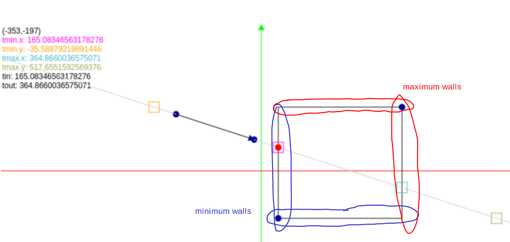

# Quick Info

### Max depth of tree structure is 11

Because there are a maximum of 23 utilizable bits in the mantissa of an [IEEE float](https://www.h-schmidt.net/FloatConverter/IEEE754.html) and we use 2 bits per level.

# Why are we doing that??

### Why are we doing some mantissa trickery when trying to find the bounds of the neighbor?

```glsl
// len = 2.0 ^ (scaleExp - 23)
float current_scale_length = uintBitsToFloat((scale - 23 + 127) << 23);
vec3 current_cell_min_postion = clear_bellow_scale(position, scale);

// Move the position to the end of this ray
// 0 if the sign is -1.0 and 1 if the sign is 1.0
vec3 plane_selector = sign(ray.direction) * 0.5 + 0.5;
vec3 plane_position = current_cell_min_postion + plane_selector * current_scale_length;
vec3 distance_to_plane = (plane_position - ray.origin) * inverse_direction;

// Intersect with the next plane to see wich one is closest
float t_max = min(min(min(distance_to_plane.x), distance_to_plane.y), distance_to_plane.z);

// Add the *exact* distance of this cell based on the closest plane to the minimum position of current cell to
// get the *exact* minimum position of the neighboring cell
uint axis_to_add = t_max == distance_to_plane.x ? 0 : (t_max == distance_to_plane.y ? 1 : 2);
current_cell_min_postion[axis_to_add] += sign(ray.direction)[axis_to_add] * current_scale_length;
vec3 neighbour_min = current_cell_min_postion;

// Add the exact length of the current cell scale. E.G: if our scale is 0.25, we add 0.24999999
vec3 neighbour_max = uintBitsToFloat(floatBitsToUint(neighbour_min) + ((1 << scale) - 1));

position = clamp(ray.origin + t_max * ray.direction, neighbour_min, neighbour_max);
```

To find the position of the next cell, we need to do a slab intersection using the t max of the current cell.

We first find the size of the current cell by using the IEEE 754 standard: 2^(exponent - 127) \* 1.Mantissa. E.G if the scale is 21 (aka the cell size is 1/4), the cell size will be calculated using 2^(21-23) -> 2^(-2) -> 1/4.

To find the minimum position of the current cell, we will just clear the bits bellow the scale that we want. This essentially "floors" the position to the current scale that we want. E.G: if we are at scale 21 (aka 1/4), and our postition is currently, 1.25789, it will "floor" to make it 1.25.

To see where our next cell begins, we need to find our t max in our formula. We could do this by the normal slab intersection, but we don't need t min. We will find the intersection with only the _exit_ planes of the intersection. If the exit plane is in the negative ray direction, then the exit will be the minimum of the two planes. Likewise, if the ray direction is the maximum, the exit will be the maximum of the two planes (aka the min + the length).

Now we only need to do one intersection calculation for this exit plane doing `t = (plane_pos - origin)/direction` and finding which plane intersection is closest by finding the minimum of all 3 axis.

We could just advance the postion by the exact t amount by doing `pos = ray.origin + t_max * ray.direction`. But the floating point error of multiplying will not always lead us to _enter_ the next cell and could lead us to stick to the current cell. We could add a bias like `0.00001` to nudge it into the next direction but this produces some artifacts. Instead we will find the exact bounds of the neighbor and clamp the ray to be within the neighbor min and max. To do this, we will advance the position by _one_ scale length in the direction of the ray to find the neighbor min position because this puts us at exactly at the _start_ of the neighbooring cell. To find the max, we add the size of a cell at the current scale. Which we defined to be the excluive end of our scale length. E.G: if our scale is 0.25, the start of our current cell can be 1.25 and the end is 1.4999999 because at 1.5 is the start of the next one. To add one scale length to our neighboor min, we will add all the bits _bellow_ the scale directly to the mantissa of the neighbor min. This makes us add everything that is right up to the edge of the length of the scale but not the scale itself which would make us jump to the cell after the neighbor.

# Things that I didn't quite understand

He made a [great explanation of 64 trees](https://dubiousconst282.github.io/2024/10/03/voxel-ray-tracing/).

#### I don't think that 0xFFAAAAAA are the high bits of each cell position.

You can put it directly into the [IEEE converter](https://www.h-schmidt.net/FloatConverter/IEEE754.html) and you will see that this is looking for the low bits. In the change and not the high bits. It doesn't matter since we always check for a change in scale, but we are checking the exact places we are trying not to.

###### Answer: They are indeed the low bits

#### Why would the different in scale be > 21 and not > 22?

The 22'nd bit in base 0 is the edge of the mantissa. This would mean that the traversal would stop at a quarter of the model if we look from the vec3(0) position into the model. After traversing from 1.25 to 1.5 it would break the traversal since it would find that bit 22 (1.5) has changed.

This doesn't break because 0xFFAAAAAA actually clears the 22'nd bit (base 0) when trying to find the first bit high.

###### Answer: Yes, but since we are only checking for a change in low bits of each scale, > 21 is the same as > 22 because of the mask.
